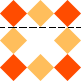

### 1. 背景
前些日子，视觉设计师突然找到我说，咱们h5中按钮的虚线框的虚线连线是不是太稀疏了，能不能稍微密集一点，而且，不同的浏览器中表现也不太一样。？？？，有这个现象？？？，我打开网站看了下，好像是有这么回事，但是border的虚线样式是系统自带的，并且不能自己定义的，调整虚线框连线的间距，这个问题有点棘手。但是看着设计师期待的目光，我只能说，让我试试吧。

<!-- more -->

### 2. 基本概念
在css中定义虚线边框的时候，我们第一个总是想到的border-style: dashed,这个属性是由css提供，浏览器原生支持的，是实现虚线框的最简单方便的方式，但是，这种方式有一个很大的弊端，那就是在各个浏览器中表现不一致，并且这种浏览器原生提供的表现样式是无法自定义覆盖的，也就是上面设计师所说的，浏览器提供的虚线间距或者样式不是你想要的，你想要短连线，或者小圆点作为虚线框的连线，但是却不能通过修改border的样式来自定义这种效果。

我们可以看看同样的虚线框代码，在不同浏览器中的表现

```html
<div class="btn">
</div>
```

```scss
.btn {
  width: 200px;
  height: 50px;
  border: 2px dashed;
}
```
  

 

虽然pc上的截图看起来都差不多，但是仔细观察还是能发现，那就是虚线框之间的连接线间距是不一样的，然而设计是给出的设计是这样的，那么如何实现这样的带圆角的虚线框，并保证在各个浏览器下表现都是一致的呢。而且，由于我们的解决方案还得需有普适性，所以要尽量满足以下两个条件
  1. 支持圆角
  2. 宽高自适应容器
  3. 不破坏dom结构

### 3. border-style
我们知道`border`一共有三个属性，而跟虚线框相关的，就只有·`border-style: dashed`了，想一想，似乎通过设置border的其他样式来实现自定义虚线框这条路是行不通的。那么原生的`border`属性无能为力，我们能不能想办法模拟出一个自己想要的虚线框呢

### 4. 伪元素模拟
在尽量不破坏原来dom结构的前提下，我们使用伪元素来模拟边框。但是伪元素`::after`和`::before`只能模拟出两条边框，那剩下的两条边框怎么办呢，这时候我们只能退而求其次，再引入别的标签来模拟剩下的两条边框。模拟的元素是凑够了，那么如何模拟出虚线框呢。
要能自定义虚线间距，还要自适应宽高，那么我们可以使用背景图片来做虚线，只要设计师给的虚线间距是特定的，那我们就不需要考虑手动控制虚线的间距了，至于自适应容器的宽高，很自然的，联想到了`background-repeat: repeat-x`来解决，同样的，高度自适应就是`repeat-y`。
用背景图片来做，就要引入额外起码两张图片，增加了http请求，这就有点不完美了，我们可以通过线性渐变`repeating-linear-gradient`来实现

```css
.btn {
  background-image: repeating-linear-gradient(to right, rgba(0,0,0,0), rgba(0,0,0,0) 5px,black 5px, black 10px,rgba(0,0,0,0) 10px);
}

```
这样就可以避免引入图片引起的额外产生的http请求了。但是这样做也有一些不足之处
  1. 为了模拟虚线额外引入了dom，破坏了原来的dom结构
  2. 不支持圆角

### 5. 图片覆盖
既然拆分模拟的思路不但占用了两个伪元素，还引入额外的dom元素破坏了原有的dom结构，那我们何不考虑整体替换呢，直接一张虚线框的图片覆盖到dom元素上，通过`pointer-events: none`来实现事件的穿透，这样不是可以一劳永逸的解决这个问题了吗。如下图，我们根据dom的尺寸，切出如下的虚线框图片


然后将这个图片覆盖到dom元素上，即实现了自定义的间距，又支持了圆角，但是问题也存在，如果元素的尺寸是动态的，那么这个图片将会被拉伸，导致不同尺寸的元素虚线框间距不一样，连线长度也不一样。这是我们不能接受的。

### 6. border-image
如果我们能克服上述方法的问题，那么这种方法就变得可以接受。将上述两种方法方法结合一下，用图片来模拟虚线边框和圆角，使用`repeat`来使尺寸实现自适应，那么就可以同时满足要求的条件了。

先看一下`border-image`使用使用方法。可参考[border-image 的正确用法](https://aotu.io/notes/2016/11/02/border-image/index.html)



```css
 border-image ： none | <image> [ <number> | <percentage>]{1,4} [ / <border-width>{1,4} ]? [ stretch | repeat | round ]{0,2}
```
虚线边框代码

```scss
%border {
    &:after {
        content: '';
        display: block;
        width: 100%;
        height: 100%;
        position: absolute;
        top: 0;
        left: 0;
        box-sizing: border-box;
        border: 1px solid #DCDCDC;
        border-radius:.08rem;
        pointer-events: none;
    }
    &.checked {
        &:after {
            top: -0.01rem;
            left: -0.01rem;
            border-width: .02rem;
            border-color: #555;
        }
        .name {
            color: #252525;
        }
    }
    &.none {
        &:after {
            border-width: .1rem;
            border-image-slice: 18;
            border-image-repeat: repeat;
            border-image-source: url('../../images/prod/bg-border-dashed@2x.png');
        }
        &.checked:after {
            top: -0.01rem;
            left: -0.01rem;
            border-image-source: url('../../images/prod/bg-border-dashed-checked@2x.png');
        }
    }
}
```

效果对比


缺点：
1. 圆角角度特定(依图片而定)，不同圆角角度需要切不同的图
2. 角落出可能会出现碎屑

兼容性


### 7. 总结
理论上来说系统提供的虚线已经够用了，但是对虚线间距无能为力，尤其是一些自定义的边框，可能不仅仅局限于虚线,可能是花纹或者别的图案，这时候我们就可以考虑用border-image来实现。但是这也增加了工作量，提升了维护难度，而且这种模拟方案可能存在一些你没有发现的问题，因此，对特定的业务场景，需要有特殊的考量，不能拘泥于惯性思维模式 。

### 8. 参考资料
[](https://aotu.io/notes/2016/11/02/border-image/index.html)