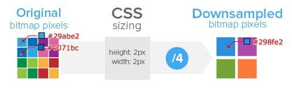
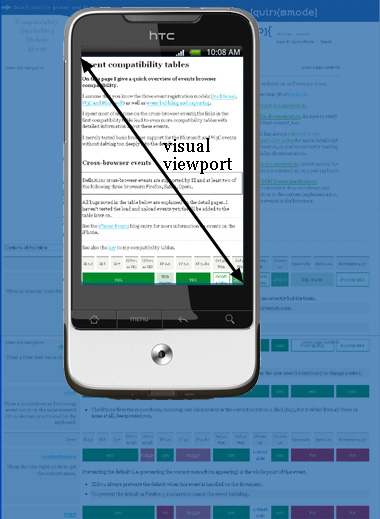

### 1. 背景
随着移动设备的越来越普及，各种智能手持设备日新月异，为人们带来方便快捷的生活方式和体验，而对于前端开发者来说，不同尺寸，不同平台的兼容性适配性问题却变得越来越麻烦，逐渐变成了一个让人头疼的问题。当然，魔高一尺，道高一丈，优秀的解决方案也不断涌现，如淘宝移动端适配方案`lib-flexible`, 网易适配方案的，真正实现了`write once, run everywhere`, 那么这种做法深层次的原理到底是怎么样的呢？

<!-- more -->

### 2. 开发流程
在前端开发之前，设计会给我们一个psd文件，称之为视觉稿。对移动端开发而言，要做到页面高清，视觉稿会遵循以下的规范：
* 首先会选取一款手机的屏幕宽高作为基准(iPhone6 375x667)
* 对于retina屏幕(如: dpr=2) ，为了达到高清效果，视觉稿的画布大小会是基准的2倍

对于我们开发来说，从设计手中拿到的应该是一份设计稿(一般是750px),以及相应的图片(@1x, @2x, @3x的图片),而我们要做的就是将设计稿还原成html页面，并且保证在不同分辨率的设备上有相同的展示效果。但是在实际的开发过程中，往往会因为屏幕大小，分辨率不同而出现一些问题。对不同屏幕大小的手机来说，如果我们使用了固定布局，如果在小屏幕手机上刚好完美布局，那么再大屏下就可能出现空隙或者留白，同样的，如果我们只考虑大屏幕的设备，那么在小屏幕上就可能会出现布局错位的情况。在某些高清屏幕(retina屏)下，1px的边框往往看起来不像是1px，因为它本可以 '更细'，而且某些图片在高清屏下可能会出现模糊的现象。带着这些问题，我们来一探究竟。

### 3. 基本概念
##### 设备像素(device-pixel)
> 又叫物理像素，显示器(手机屏幕)上最小的物理显示单元，在操作系统的调度下，每一个设备像素都有自己的颜色值和亮度值。
 
##### 设备独立像素(device-independent-pixel)
> 逻辑像素，计算机坐标系统中的一个点，该点代表一个可由程序使用并控制的虚拟像素，然后由相关系统转换为物理像素。这是一个逻辑上存在的单位，在dpr=1的屏幕下，1设备独立像素由1物理像素来渲染，而在dpr=2的高清屏幕下，当1px设备独立像素由4个一组的物理像素来渲染，比较直观的理解是1px css像素由4个物理像素来渲染(此时设备独立像素=css像素=屏宽）
 
##### Css像素
> 是一个相对值。独立于设备的 用于逻辑上衡量像素的单位。可以理解为“直觉”像素，css和js中使用的抽象单位。一般情况下我们认为  css像素==设备独立像素

##### 设备像素比(dpr)
> dpr = 物理像素/设备独立像素(在某一方向上，x方向或者y方向)，是指在移动开发中设备独立像素个css像素占用多少物理像素，如2代表1个css像素用2x2个物理像素像素来渲染。未缩放情况下，即为1css像素由多少物理像素来渲染。在js中，通过window.devicePixelRatio来获取，在css中通过device-pixel-ratio来获取。

下图中一组红绿蓝组成一个物理像素点,图像由许许多多的物理像素点组合渲染出来，最终达到我们页面上看到的效果。


在普通屏幕下，1设备独立像素(css像素）由1物理像素渲染，1:1;而在dpr为2的屏幕下，1设备独立像素(css像素)是由4物理像素来渲染，1:4。


从下面的图片中可以很直观的看出渲染效果，高清屏下渲染1css像素由更多的物理像素点来渲染，因此看上去更加的细腻清晰。


根本原理就是渲染同样尺寸的css像素，高清屏用了更多的物理像素点，使得单位面积的像素点数目更多(ppi更高)

 


### 4. 图片高清问题
##### 位图像素
> 一个位图像素是栅格图像(如：png, jpg, gif等),最小的数据单元。每一个位图像素都包含着一些自身的显示信息(如：显示位置，颜色值，透明度等)。

理论上来说，1个位图像素对应于1个物理像素，图片才能得到完美清晰的展示，在一般的屏幕下，我们也确实是这么做的，假设需要显示一个`200x300px`的图片元素，那我们用一张`200x300px`的图片便能完美呈现，但是在如果在高清屏下，这么做图片就会显得有点模糊。还是以iphone6为例，又上面的内容我们可以知道，在iphone6下，1个设备独立像素实际上是由4个物理像素点来渲染，那么`200x300`像素的图实际上就会有`400x600`个物理像素点来渲染，而我们提供的图片却只有`200x300`，因此便会出现1个位图像素由4个物理像素点来渲染的情况，而问题是这4个像素点所取的色值跟这1个位图像素的色值是不一样的，遵循的原理是就近取色，色值只能跟这个位图像素的色值相近，而不是相同，因此图片会在高清屏下出现模糊的情况。


那么这种情况我们怎么解决呢，答案就是@2x图，也就是2倍图。这也是为什么在一开始说设计师将画布放大，提供@2x图和@3x图(为dpr为3的设备准备)的原因。在iphone6下，我们渲染一个`200x300px`的图，使用的将是@2x图，也就是`400x600px`的元素，由于1css像素由4物理像素渲染，那么一个位图像素一一对应一个物理像素，达到1:1的匹配度，高清图得以完美呈现。

但是如果我们在所有的屏幕上都是用@2x图的话，又会出现什么问题呢。前面说到了在dpr为1的屏幕下，1css像素=1物理像素，之间已经是1:1对应的关系了。还举之前的栗子，我们有一个`200x300px`的图片元素要渲染，提供了@2x的图来渲染这个元素，因为1css像素由1物理像素来渲染，提供的`400x600`像素的图就会显得有点'多余'，1个物理像素点只能就近的选取1个位图像素来渲染。虽然不会造成模糊，但是看起来图片却是损失了锐利度，而且造成了资源的浪费。


如何解决这种问题？前文中提到，我们可以在css和js中都可以获取到dpr，那么我们通过不同的dpr来加载不同的图片。针对不同的dpr，当需要图片的时候，我们可以在图片url上缀上@2x还是@3x图片的信息，比如需要一张图logo.png,它的地址是
`http://www.test.com/img/logo.png`
那么，在dpr不同的设备下，这个url的文件名应该是不同的
```js
// dpr = 1
http://www.test.com/img/logo.png

// dpr = 2
http://www.test.com/img/logo_@2x.png

// dpr = 3
http://www.test.com/img/logo_@3x.png
```
具体到代码中，我们可以借助scss，less等工具来实现，根据不同的dpr加载不同的图片。

### 5. 1px边框问题
图片1像素边框的问题大概是设计师比较关注的问题，那么，什么是1像素边框问题。在retina屏幕下，1px的css像素实际上是由4个物理像素来渲染的，体现在宽高上就是1px宽的border，实际上是由2px的物理像素来渲染的。设计稿上是最细的线1px的边框，在实际的retina屏幕下却是由2物理像素来渲染的，而设计师要的则是最细的1px的物理像素渲染的线。也就是说，实际上我们需要在代码中写0.5px，那这样，这条线就会由1个物理像素的宽度了。但是问题是，除了iOS 8及以上，ios7以下，android等其他系统里，0.5px会被当成为0px处理。


如何实现这样的一个0.5px的线呢，一种简单的做法就是元素的scale
```CSS

.scale{
    position: relative;
}
.scale:after{
    content:"";
    position: absolute;
    bottom:0px;
    left:0px;
    right:0px;
    border-bottom:1px solid #ddd;
    -webkit-transform:scaleY(.5);
    -webkit-transform-origin:0 0;
}

```

我们在代码中继续写`border: 1px solid #ddd`,然后通过`transform:scaleY(0.5)`缩小0.5倍来达到0.5px的目的，但是这样的hack不够通用(比如圆角)，写起来也很麻烦。
网上解决方案也很多，这里比较推荐的还是`页面整体scale`方案，对于`dpr=2`的页面，比如iphone6，加入如下的`meta`标签，将页面缩放`1/dpr`以实现0.5px的效果。
```html
<meta name="viewport" content="width=640,initial-scale=0.5,maximum-scale=0.5, minimum-scale=0.5,user-scalable=no">
```
这样可以完美实现1px物理像素的线，但是同时也带来了一些问题：
* 字体大小会被缩放
* 页面布局也会被缩放
这两个问题后面会讲到。

### 6. 多屏适配问题
做PC页面的时候，我们按照设计图的尺寸来就好，这个侧边栏200px，那个按钮50px的。可是，当我们开始做移动端页面的时候，设计师给了一份宽度为750px的设计图。那么，我们把这份设计图实现在各个手机上的过程就是『适配』。

上图是著名的手淘前端团队的协作模式，而整个手淘设计师和前端开发的适配协作基本思路是：
* 选择一种尺寸作为设计和开发基准
* 定义一套适配规则，自动适配剩下的
* 特殊适配效果给出设计效果
在设计和开发协作过程中，设计师通常会以iphone6为基准设计尺寸，交付给前端的是`750x1334px`的设计图，前端开发人员通过一套适配规则自动适配到其他的尺寸。在研究适配方案以前，我们先普及一下基本的概念。
##### layout viewport
> layout viewport的概念其实跟pc端的viewport是一样的，是作为html的”上层“元素。将宽继承给html。html内的各元素都是以layout viewport为基准进行布局的。但跟pc端不同的是，pc端的viewport的宽是由浏览器的窗口的宽决定的，用户可以手动拖动窗口改变宽的大小。但是移动端的不同平台的浏览器呈现不同的layout viewport。

##### visual viewport
> 将visual viewport想象成覆盖手机屏幕的一个框，这个框带有类似pc端缩放的功能，而且这个框的度量单位也是css像素。这就意味着，在layout viewport不变的情况，我们能看到多少css像素的东西，取决于这个框的缩放程度。默认情况下。大多数移动端浏览器会将visual viewport这个框缩放到与layout viewport相同。

##### ideal viewport
> 理想视口，不需要用户缩放和横向滚动条就能正常的查看网站的所有内容；显示的文字的大小是合适，何种分辨率下，显示出来的大小都是差不多的。当然，不只是文字，其他元素像图片什么的也是这个道理。Ideal viewport尺寸视屏幕而定，即屏幕宽度，也就是设备独立像素尺寸。

拿ios设备举例，layout viewport固定为980px，默认打开页面的情况下，visual viewport会将这个框缩放到980px。这样我们就能看到全部的内容了

  

默认情况下html元素的宽取自layout viewport，那么不同机型浏览器的layout是不同的，ios980px，android800px。在pc端我们通过document.documentElement.clientWidth取得viewport的宽度。在移动端中，clientWidth获取的将是layout viewport的尺寸，而innerWidth获取的是visual viewport的尺寸。一般情况下我们会设置meta标签：

```CSS

width：控制 layout viewport 的大小。
height：和 width 相对应，指定高度。
initial-scale：初始缩放比例，也即是当页面第一次 load 的时候缩放比例。
maximum-scale：允许用户缩放到的最大比例。
minimum-scale：允许用户缩放到的最小比例。
user-scalable：用户是否可以手动缩放

```

meta标签中的width设置的就是layout viewport的尺寸，默认情况下，visual viewport会将页面缩放到和layout viewport同样的宽度，具体情况请看[viewport知识](https://segmentfault.com/a/1190000004403496).当我们设置以下meta标签的时候，ideal viewport = visual viewpor = layout viewport;
```html
<meta name="viewport" content="width=device-width, initial-scale = 1, user-scalable=no" />
```

目前来说，移动端适配方案最实用的方案莫过于使用rem进行适配。对于rem的适配，我们要做的就是针对不同dpr不同尺寸改变html元素的`font-size`大小，网易的移动端适配方案，还有手淘的`lib-flexible`都是基于此原理的。

##### 网易rem方案
详情请查看[使用Flexible实现手淘H5页面的终端适配](http://www.w3cplus.com/mobile/lib-flexible-for-html5-layout.html);具体操作步骤如下。
* 设置以下meta标签
```HTML
<meta name="viewport" content="initial-scale=1,maximum-scale=1, minimum-scale=1">
```

* 计算html的font-size
取参考标准1rem = 100px;换算关系为1px = 1/100rem；以750px设计稿为例，整体宽7.5rem；
页面上以7.5rem 为参考，则1rem = window.innerWidth / 7.5 + 'px'; 
所以document.documentElement.style.fontSize = window.innerWidth / 7.5 + 'px'; 也就是说html的`font-size`大小，即rem始终是1rem = 屏幕宽度/(设计稿宽度/100),由此可算出以下设备的html的`font-size`值
* iphone 5 ：320/7.5 = 42.667px
* iphone 6 : 375/7.5 = 50px;
* iphone 6p: 414/7.5 = 55.2px;

查看[网易新闻的webapp页面](http://3g.163.com/touch/news/subchannel/all?dataversion=A&uversion=A&version=v_standard#adaptation=pc)，跟我们的计算值一样。当然，对640的设计图来说，这个基准值就由7.5变成了6.4，其他步骤还是不变的，参考设计图写代码的时候，仍然是1rem = 100px，在别的尺寸屏幕下就会进行自动适配。理论上来说，1rem可以设置为任意值的px，为什么要取100这个系数，是因为这样是为了方便进行rem值的计算。如果设计稿中有一个`200x300px`的元素，那我们可以直接口算出rem值
```CSS
width: 2rem;
height: 3rem
```

但是这个方案仍然有弊端，在retina屏幕下，1css像素依然由多个物理像素来渲染
，由此带来的1px边框问题仍然没有得到解决，只是解决了布局自动适配的问题。

##### 手淘lib-flexible方案
* 在flexible中，只对iOS 进行了判断，对于安卓设备，始终认为其dpr为1.
```javascript
if (!dpr && !scale) { 
    var isAndroid = win.navigator.appVersion.match(/android/gi); 
    var isIPhone = win.navigator.appVersion.match(/iphone/gi);
    var devicePixelRatio = win.devicePixelRatio;
    if (isIPhone) { // iOS下，对于2和3的屏，用2倍的方案，其余的用1倍方案 
        if (devicePixelRatio >= 3 && (!dpr || dpr >= 3)) { 
            dpr = 3; 
        } else if (devicePixelRatio >= 2 && (!dpr || dpr >= 2)){ 
            dpr = 2; 
        } else { 
            dpr = 1; 
        } 
    } else {
        // 其他设备下，仍旧使用1倍的方案 
        dpr = 1; 
    } 
    scale = 1 / dpr; 
}

```

* flexible会根据dpr动态计算页面的缩放值，将scale设置为`1/dpr`,这样一来，由于将页面缩小为原来的`1/dpr`倍,使得1css像素正好对应1物理像素。
```js
docEl.setAttribute('data-dpr', dpr);
    if (!metaEl) {
        metaEl = doc.createElement('meta');
        metaEl.setAttribute('name', 'viewport');
        metaEl.setAttribute('content', 'initial-scale=' + scale + ', maximum-scale=' + scale + ', minimum-scale=' + scale + ', user-scalable=no');
        if (docEl.firstElementChild) {
            docEl.firstElementChild.appendChild(metaEl);
        } else {
            var wrap = doc.createElement('div');
            wrap.appendChild(metaEl);
            doc.write(wrap.innerHTML);
        }
    }
```

* 动态设置html的`font-size`值，将其设置为页面宽度width的十分之一(hack 10vw);即`1rem = clientWidth/10`,将页面整体分为10分，也就是10rem。lib-flexible中使用getBoundingClientRect来计算html的宽度，后期改为clientWidth。
```js
function refreshRem(){
    var width = docEl.getBoundingClientRect().width;
    if (width / dpr > 540) {
        width = 540 * dpr;
    }
    var rem = width / 10;
    docEl.style.fontSize = rem + 'px';
    flexible.rem = win.rem = rem;
}
```

经过这样的设置，根据dpr动态缩放页面，使得1css像素对应1物理像素，然后将html的`font-size`设置为页面宽度的1/10进行布局的适配。例如，750px的设计稿，通过计算html的`font-size`应该是`750/10 = 750px`, 即`1rem = 75px`;在iphone6下，屏宽375px；由于dpr为2，那么scale将为0.5，因此，经过缩放的页面layout viewport的宽度应该为750px，刚好跟设计稿对应，设计稿中`200x300px`的区域，写代码的时候也是`200x300px`,然后将px转化为rem就可以了。这个转化工作可以使用插件来做，或者用postcss的插件`px2rem`来进行转化。

*优点*
* 通过缩放页面，使得1css像素对应1物理像素，解决了由此带来的1px边框问题和布局适配问题。

*缺点*
* rem需要动态的计算，口算难度有点大，需要借助插件或者构建工具。并且没有考虑ipad或者dpr不为1的安卓，在这些设备下依然存在1px边框问题。


上面两种方案无论是网易的适配方案，还是flexible方案，都需要加载一段js来动态的计算rem，flexible可以看成是网易方案的加强版，都可以满足适配的条件。而对于字体来说，我们希望在不同尺寸的设备上看到同样大小的文字，不希望文本在retina屏幕下变小，另外我们希望在大屏幕上看到更多的文字。而现在绝大多数字体文件都带一些点阵尺寸，通常是16px， 24px，不希望出现13px， 17px这样的尺寸，而rem计算出来的尺寸却很可能出现这些奇数尺寸。
如此一来，在写h5页面的过程中，rem并不适合应用到文本上，所以flexible中建议文本不使用rem做单位，仍然用px，只不过需要通过`[data-dpr]`属性区分不同dpr设备下的字体大小。
```CSS
div { 
    width: 1rem; 
    height: 0.4rem; 
    font-size: 12px; // 默认写上dpr为1的fontSize 
} 
[data-dpr="2"] div { 
    font-size: 24px; 
} 
[data-dpr="3"] div { 
    font-size: 36px; 
}
```

当然也可以用过scss less这样的css预处理工具来处理
```SCSS
@mixin font-dpr($font-size){ 
    font-size: $font-size; 
    [data-dpr="2"] & { 
        font-size: $font-size * 2; 
    } 
    [data-dpr="3"] & { 
        font-size: $font-size * 3; 
    } 
}
```

##### flexible2.0方案
上面介绍的`lib-flexible`方案其实是对vw/vh的hack，而随着移动端对vw/vh的逐渐支持，这种hack也会慢慢变得没有必要。[flexible2.0方案](https://www.w3cplus.com/css/vw-for-layout.html)便直接使用vw/vh进行适配。当然这样做也是存在风险的，因为还有很多设备不支持vw/vh,直接使用这种方案略显激进。而且不缩放页面，1px问题又会随之出现。

以上是关于移动端适配性问题的一点浅薄理解，如有不对的地方，还望指正。

### 参考资料
部分观点引用下面资料。
[http://www.w3cplus.com/css/viewports.html](http://www.w3cplus.com/css/viewports.html)
[http://www.w3cplus.com/mobile/lib-flexible-for-html5-layout.html](http://www.w3cplus.com/mobile/lib-flexible-for-html5-layout.html)
[http://www.w3cplus.com/css/towards-retina-web.html](http://www.w3cplus.com/css/towards-retina-web.html)
[https://div.io/topic/1092](https://div.io/topic/1092)
[https://segmentfault.com/a/1190000004403496](https://segmentfault.com/a/1190000004403496)
[https://github.com/jawil/blog/issues/21](https://github.com/jawil/blog/issues/21)
[https://zhuanlan.zhihu.com/p/25216275](https://zhuanlan.zhihu.com/p/25216275)
[http://www.cnblogs.com/lyzg/p/4877277.html](http://www.cnblogs.com/lyzg/p/4877277.html)
[http://www.cnblogs.com/lyzg/p/5058356.html](http://www.cnblogs.com/lyzg/p/5058356.html)
[http://web.jobbole.com/90084/](http://web.jobbole.com/90084/)
[https://www.w3cplus.com/css/vw-for-layout.html](https://www.w3cplus.com/css/vw-for-layout.html)

