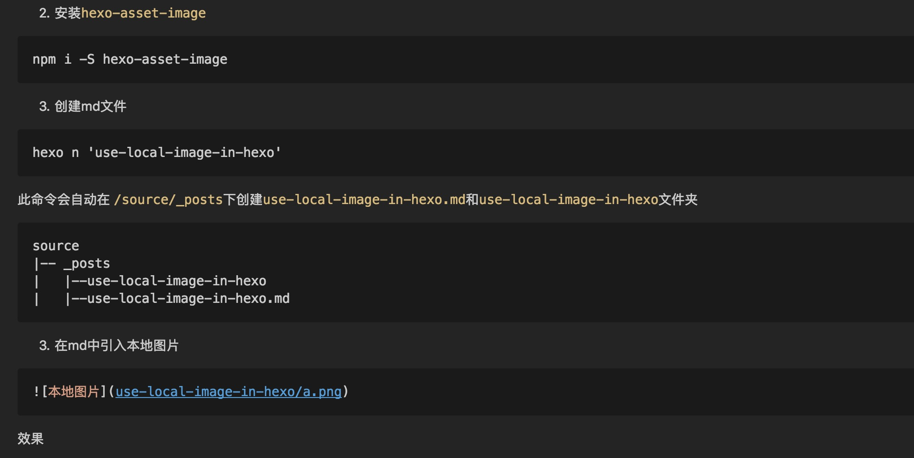

### 1. 背景

以前使用hexo搭建自己的博客，曾在图片如何使用上纠结过，想直接放到source中随文章一起发布上去，但是考虑到后面随着文章的增加，图片数量将会膨胀到一个令人头皮发麻的数量，大量的图片一起堆叠到一起，根本没法管理和维护了。为了图省事，最终还是使用了七牛的图床，但还是所有的图片都一起存放，没有层次感和分类，管理起来还是难受，而且每次都需要先把图片传到七牛，然后再复制外链到文章中，依然很麻烦。但好处是图片放到了七牛，因为静态资源域名跟文章域名分离开来了，所以能提升一些加载速度。

然而，前段时间七牛对域名进行了清理，因此我的博客上所有的图片都挂了，要重新绑定域名需要进行实名认证，要拍照进行人工审核，相当麻烦，当然，另一方面也是我不愿意将自己的个人资料交给这种第三方机构，痛定思痛，我决定对自己的博客图片重新进行处理

<!--more-->
<br>

### 2.解决思路

基本的思路还是让图片随文章一起发布，但不是杂乱无章的一股脑source下面，而是分类存放，每个文章有自己的目录，里面存放相应静态资源文件，不仅仅是图片，还可以包含视频，音频等资源文件。因为博文一般都不会有很多的图片或者视频，因此我们不需要在文件夹里面进行再次的分类，这时候跟本文章有关的图片，视频放到一起，让人一目了然。帮助我们实现这个目标的插件是 `hexo-asset-image`.

### 3.使用方法

1. 配置hexo
在hexo根目录下的`_config.yml`中,将`post_asset_folder`设置为true（默认为false)
```
post_asset_folder: true
// 此属性开启，将会在你使用命令`hexo n 'article name' 的时候，自动在`/source/_posts下创建跟md文件同名的文件夹
```

2. 安装`hexo-asset-image`
```
npm i -S hexo-asset-image
```

3. 创建md文件
```
hexo n 'use-local-image-in-hexo'
```
此命令会自动在 `/source/_posts`下创建`use-local-image-in-hexo.md`和`use-local-image-in-hexo`文件夹。_注意_ ,只有通过`hexo n `命令新建的md文件才会自动创建同名的文件夹，如果是通过邮件新建文件的形式创建md文件，则不会创建同名文件夹。当我们的文章中不需要图片等资源时，可以使用手动新建md文件的方式来创建md文件，但是这样会导致有的文件是以目录方式存放，有的文章直接以md文件形式存放，有点混乱，不建议这么做。

```
source
|-- _posts
|   |--use-local-image-in-hexo
|   |--use-local-image-in-hexo.md
```

4. 在md中引入本地图片
我们在新创建的同名文件夹中放入一张测试图片`a.png`
```
source
|-- _posts
|   |--use-local-image-in-hexo
|   |   |--a.png  
|   |--use-local-image-in-hexo.md
```
```md

```
效果


### 4. 生成html
至此，我们开发过程已经完成，那么在md转化成html文件之后图片还能正常显示么，答案是肯定的,我们执行生成命令
```
hexo g
```
生成了如下的目录